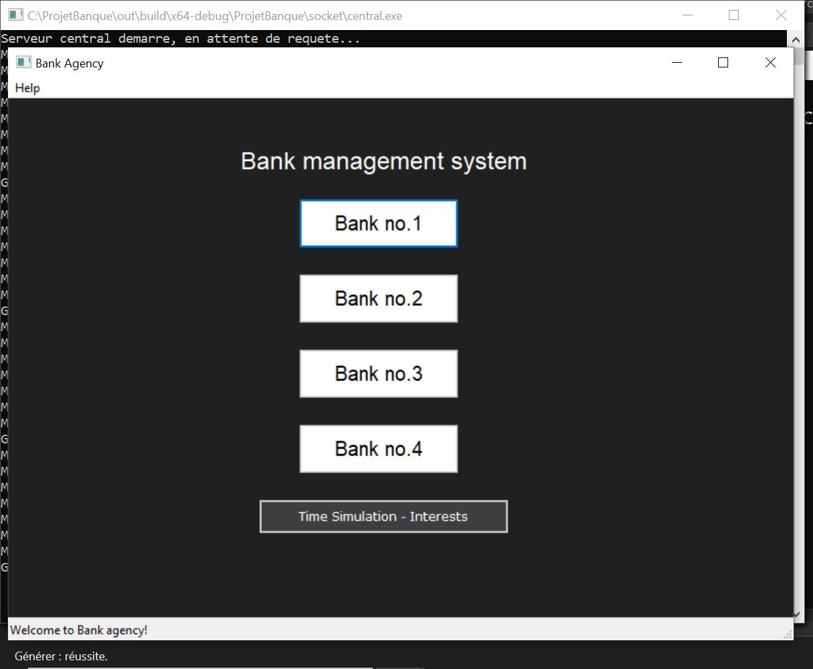
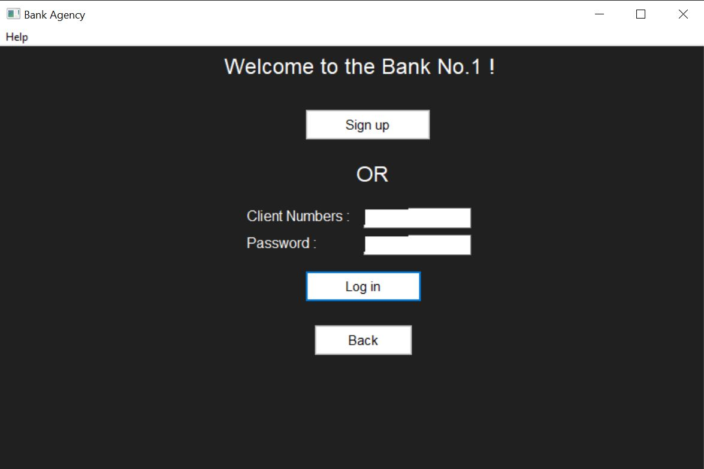
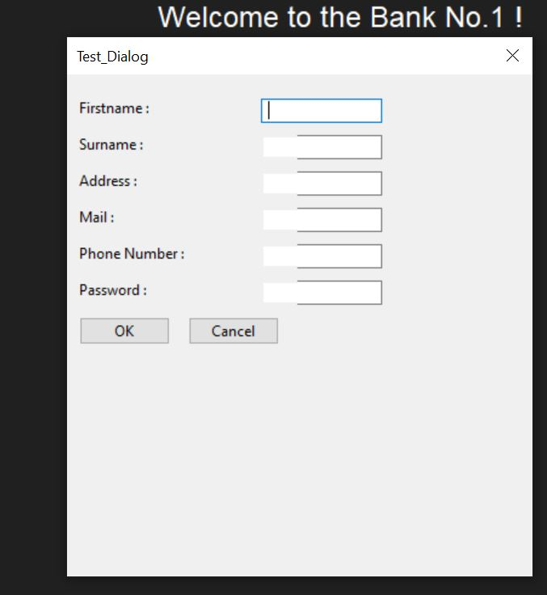
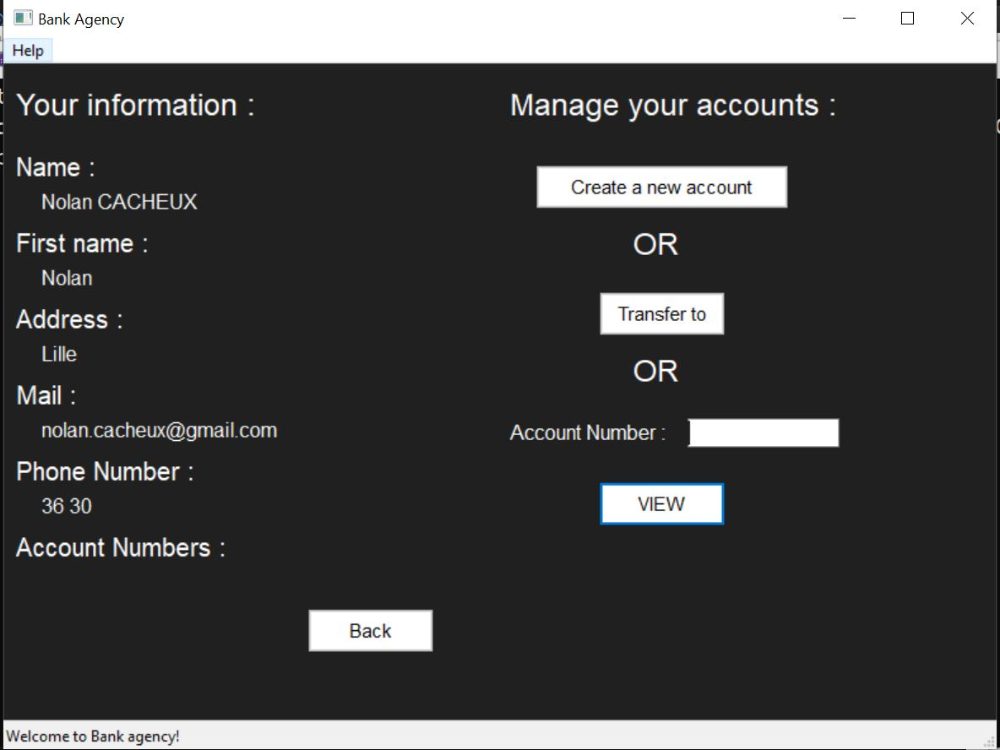

# Projet NEMM Bank 

## Auteurs
- **N**olan Cacheux
- **E**liott Peres
- **M**ilo Montuori
- **M**atthieu Host

## Dossier `out`

**Le dossier `out` est important !**

Il ne contient pas les exécutables et leurs dépendances, mais les fichiers JSON "de base" nécessaires pour utiliser la banque.

Ces fichiers incluent les informations des clients (qui peuvent être ajoutés graphiquement). Pour une utilisation simplifiée, il est nécessaire d'avoir des clients, des comptes et des opérations (par exemple, le fichier JSON nommé `data.json` correspond à la Banque n°1 et contient le plus d'informations pour permettre les tests).

## Lancement du projet

Pour lancer le projet, exécutez le fichier `start.cpp` à la racine du projet. Ainsi, tous les exécutables nécessaires pour le bon fonctionnement seront créés, selon les fichiers CMake.

## Fonctionnalités actuelles

- Gestion de plusieurs banques
- Récupération des opérations toutes les 10 secondes
- Utilisation de threads pour gérer la banque centrale
- Virements fonctionnels (en interne et entre deux banques)